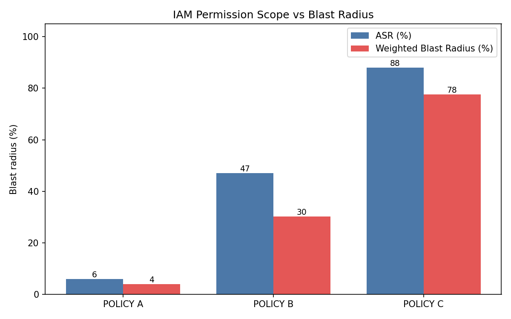

# IAM Blast-Radius Experiment

**A controlled cloud-security experiment measuring how IAM permission scope changes the blast radius of a compromised AWS identity.**

🔗 **[Live dashboard →](https://olafier.github.io/iam-blast-radius-lab/)**

Part of the research project *AI-Enhanced Attacks on Cloud Infrastructure*. AI can accelerate the early stages of an attack chain, but once an attacker holds a cloud identity, the damage is bounded by that identity's **IAM permissions** — not by the AI. This experiment isolates that single variable and measures its effect.

---

## Research question

> **How does IAM permission scope affect the blast radius of a compromised cloud identity?**

If an identity is already compromised, how much more can a broadly-permissioned identity reach, change, or destroy compared to a least-privilege one — measured quantitatively?

## Method

A controlled experiment with one independent variable. Three test identities are each subjected to the **same fixed set of 100 AWS actions** across **12 services** (S3, EC2, IAM, STS, Lambda, DynamoDB, KMS, CloudTrail, CloudWatch Logs, Secrets Manager, SSM, RDS). The only thing that changes between runs is the IAM policy attached to the identity.

| | Independent variable | Dependent variable | Controlled |
|---|---|---|---|
| **What** | IAM permission scope | Blast radius | Fixed action set + conditions |
| **Levels** | Policy A / B / C | ASR & Weighted BR | Identical for every run |

**Policies**
- **Policy A — Narrow (least privilege):** read one S3 bucket, write its own logs, know its own identity.
- **Policy B — Moderate (operational):** broad read + operational writes across services; no delete, no IAM.
- **Policy C — Broad (PowerUser-like):** full access to most services (`s3:*`, `ec2:*`, …) but IAM read-only.

## Metrics

AWS returns only raw Allow/Deny decisions — there is no built-in "blast radius" score. Both metrics below are defined by this project, with weights fixed **before** any run so they cannot be tuned to the result.

**Action Success Rate** — every action counts equally:
```
ASR = successful actions / total attempted × 100
```

**Impact-Weighted Blast Radius** — actions weighted by severity (READ 1 · WRITE 2 · DESTROY 3 · ESCALATE 4):
```
WBR = Σ weight(successful) / Σ weight(all) × 100
```

## Results



| Identity | Actions allowed | ASR | Weighted BR |
|----------|:---------------:|:---:|:-----------:|
| Policy A — Narrow   | 6 / 100  | 6.0 %  | 3.9 %  |
| Policy B — Moderate | 47 / 100 | 47.0 % | 30.2 % |
| Policy C — Broad    | 88 / 100 | 88.0 % | 77.6 % |

### Key finding

Policy C reaches **88 %** of the action set — but its Weighted Blast Radius is only **77.6 %**. The 12 actions it *cannot* perform are exactly the high-weight **IAM identity-mutation** actions (`iam:CreateUser`, `iam:AttachUserPolicy`, `iam:PassRole`, …). In other words, **even a broad PowerUser identity cannot escalate its own privileges** — which is precisely why least privilege on IAM matters most. The weighted metric surfaces this; a raw action count would hide it.

## How to run

Everything is driven by the same three policy files, so mock and real modes agree.

**Mock mode** — no AWS needed, evaluates the policy JSON locally:
```bash
python3 run_experiment.py --mock
python3 compute_metrics.py
```

**Simulate mode** — uses the real **AWS IAM Policy Simulator** (`iam:SimulateCustomPolicy`) to evaluate all 100 actions with AWS's own engine. No S3/EC2/IAM resources are created and nothing is changed, so it is free and safe:
```bash
pip install boto3
python3 run_experiment.py --simulate --region us-east-1
python3 compute_metrics.py
```
A single self-contained version (`blast_radius_simulate.py`) is also included for running directly in **AWS CloudShell** — upload it and run, no local setup required.

## Repository layout

```
iam-blast-radius-lab/
├── policies/            # Policy A / B / C as real IAM JSON
├── action_set.py        # 100 actions + service + category + weight
├── run_experiment.py    # mock / simulate runner → results_raw.json
├── compute_metrics.py   # ASR + Weighted BR + chart
├── setup_lab.py         # (optional) provision real IAM users/resources
├── docs/                # live dashboard (GitHub Pages)
└── results/             # metrics, per-action matrix, chart
```

The dashboard loads `results/results_raw.json`; drop in a real `results_raw.json` from a simulate run and it updates automatically.

## Limitations

The experiment measures **reachable actions within a fixed test set in a controlled lab** — not real-world business impact. The category weights are a proposed scoring scheme, not an AWS standard. Results should not be extrapolated to "double the permissions = double the damage."

## Connection to the wider research

This experiment is the first hands-on phase of the broader research project **[AI-Enhanced Attacks on Cloud Infrastructure](https://github.com/olafier/ai-enhanced-attacks-cloud)**, which studies how AI accelerates the cloud attack chain (as in the UNC6426 case study). AI can speed up reconnaissance and shorten the time between attack steps — but once an attacker holds a cloud identity, the impact is bounded by that identity's IAM permissions. This lab isolates that variable and measures it.

It is also the first step of a longer roadmap that extends toward OIDC / CI-CD identities, CloudTrail-based detection, and AI-assisted log analysis.

---

*Skills demonstrated: AWS IAM & least privilege, permission boundaries, blast-radius analysis, boto3 automation, controlled experiment design, data visualization.*
